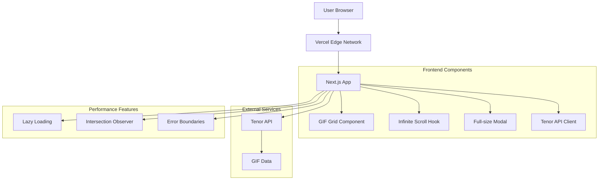
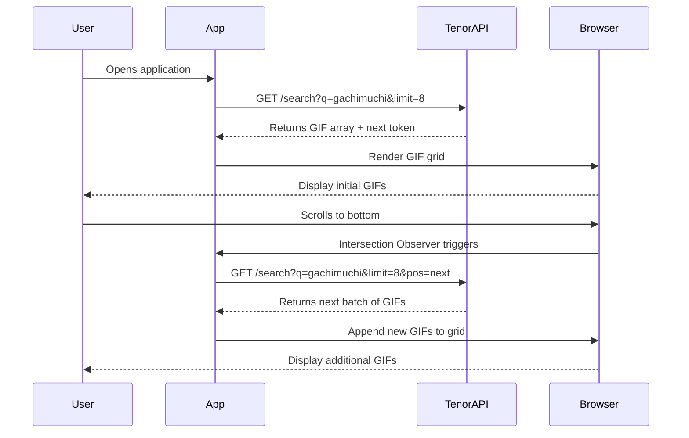
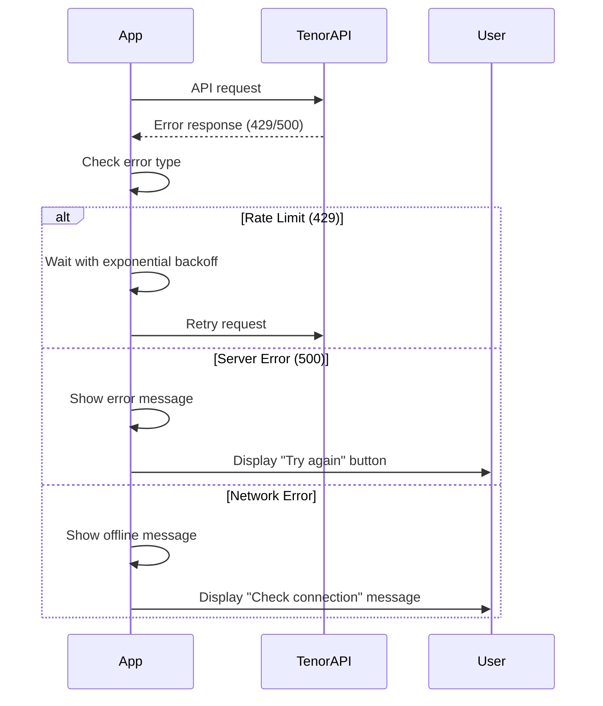
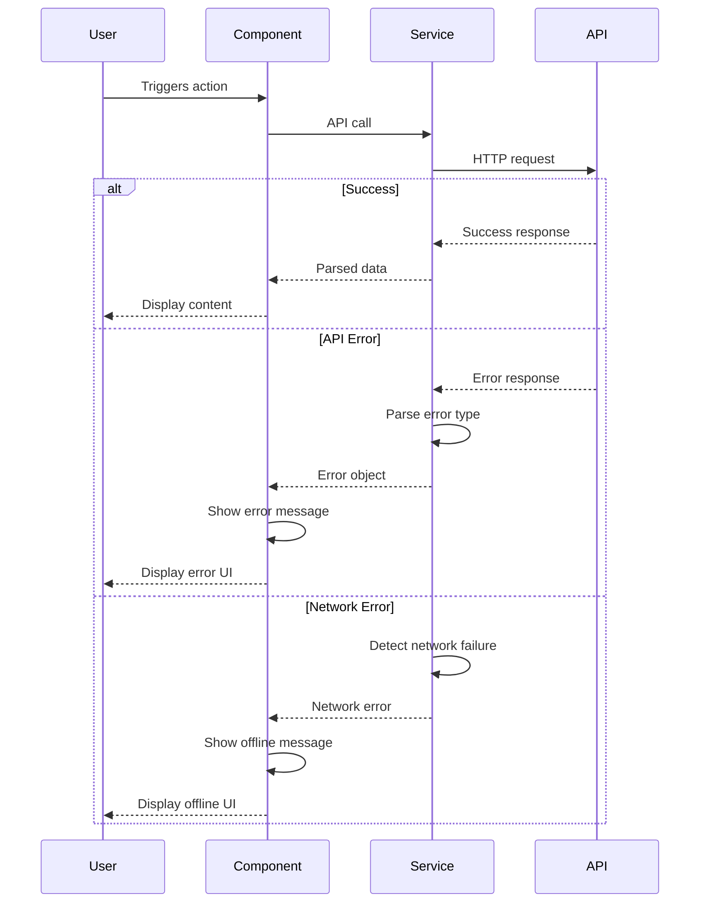

# Gachimuchi GIF Wall Fullstack Architecture Document

## Introduction

This document outlines the complete fullstack architecture for the Gachimuchi GIF Wall, including frontend implementation and external API integration. It serves as the single source of truth for AI-driven development, ensuring consistency across the entire technology stack.

This unified approach combines what would traditionally be separate backend and frontend architecture documents, streamlining the development process for modern fullstack applications where these concerns are increasingly intertwined.

### Starter Template or Existing Project

**N/A - Greenfield project**

This is a new Next.js project with no starter template dependencies.

### Change Log

| Date       | Version | Description                             | Author              |
| ---------- | ------- | --------------------------------------- | ------------------- |
| 2025-01-12 | 1.0     | Initial fullstack architecture creation | Winston (Architect) |

## High Level Architecture

### Technical Summary

This is a Next.js frontend-only application deployed on Vercel with client-side Tenor API integration. The architecture focuses on performance optimization through infinite scrolling using Intersection Observer API, responsive CSS Grid layouts, and lazy loading. No backend services are required as all logic runs in the browser with proper CORS handling for external API calls.

### Platform and Infrastructure Choice

**Platform:** Vercel

- **Key Services:** Vercel Edge Network, Next.js hosting, automatic deployments
- **Deployment Host and Regions:** Global edge network

**Rationale:**

- Next.js-first platform with zero-config deployment
- Global CDN for optimal performance
- Built-in performance optimizations
- Free tier suitable for MVP

### Repository Structure

**Structure:** Monorepo

- **Monorepo Tool:** N/A (single app)
- **Package Organization:** Single Next.js app with organized folders

### High Level Architecture Diagram



### Architectural Patterns

- **Jamstack Architecture:** Static site generation with serverless APIs - _Rationale:_ Optimal performance and scalability for content-heavy applications
- **Component-Based UI:** Reusable React components with TypeScript - _Rationale:_ Maintainability and type safety across large codebases
- **Client-Side State Management:** React hooks and context - _Rationale:_ Simple state needs without external libraries
- **API Client Pattern:** Centralized Tenor API integration - _Rationale:_ Consistent error handling and request management
- **Intersection Observer Pattern:** Native browser API for scroll detection - _Rationale:_ Performance and browser optimization
- **Lazy Loading Pattern:** Progressive image loading - _Rationale:_ Performance with large GIF collections

## Tech Stack

| Category             | Technology                   | Version | Purpose                              | Rationale                                              |
| -------------------- | ---------------------------- | ------- | ------------------------------------ | ------------------------------------------------------ |
| Frontend Language    | TypeScript                   | 5.9.2   | Type safety and developer experience | Compile-time error checking and better IDE support     |
| Frontend Framework   | Next.js                      | 15.1.8  | React framework with SSR/SSG         | Built-in optimizations, Vercel integration, App Router |
| UI Component Library | None                         | -       | Custom components                    | Simple app doesn't need external UI library            |
| State Management     | React Hooks                  | 19.1.1  | Local state management               | Built-in React state management sufficient             |
| API Style            | REST                         | -       | Tenor API integration                | Tenor provides REST API                                |
| Database             | None                         | -       | No data persistence                  | Client-side only application                           |
| Cache                | Browser Cache                | -       | HTTP caching                         | Leverage browser and Vercel edge caching               |
| File Storage         | None                         | -       | No file uploads                      | GIFs served from Tenor CDN                             |
| Authentication       | None                         | -       | No user accounts                     | Public browsing application                            |
| Frontend Testing     | Jest + React Testing Library | Latest  | Component and hook testing           | Industry standard for React testing                    |
| Backend Testing      | N/A                          | -       | No backend                           | Frontend-only application                              |
| E2E Testing          | Playwright                   | Latest  | End-to-end testing                   | Modern E2E testing framework                           |
| Build Tool           | Next.js                      | 15.1.8  | Built-in build system                | Next.js handles all build optimizations                |
| Bundler              | Webpack (via Next.js)        | -       | Module bundling                      | Next.js uses Webpack internally                        |
| IaC Tool             | Vercel CLI                   | Latest  | Infrastructure as code               | Vercel handles infrastructure                          |
| CI/CD                | GitHub Actions               | -       | Continuous integration               | Free CI/CD with GitHub integration                     |
| Monitoring           | Vercel Analytics             | -       | Performance monitoring               | Built-in Vercel analytics                              |
| Logging              | Console + Vercel             | -       | Application logging                  | Browser console and Vercel logs                        |
| CSS Framework        | Tailwind CSS                 | 4.0     | Utility-first CSS                    | Rapid development and consistent styling               |

## Data Models

### GIF

**Purpose:** Represents a GIF from the Tenor API with all necessary display properties.

**Key Attributes:**

- id: string - Unique identifier from Tenor
- title: string - GIF title/description
- url: string - Direct GIF URL for display
- preview: string - Preview/thumbnail URL
- dimensions: { width: number, height: number } - GIF dimensions
- created: string - Creation timestamp

**TypeScript Interface:**

```typescript
interface GIF {
  id: string;
  title: string;
  url: string;
  preview: string;
  dimensions: {
    width: number;
    height: number;
  };
  created: string;
}
```

**Relationships:**

- Part of GIF collection/array
- Displayed in grid layout
- Clickable for full-size view

### Tenor API Response

**Purpose:** Type definition for Tenor API response structure.

**Key Attributes:**

- results: GIF[] - Array of GIF objects
- next: string - Pagination token for next page
- error: string - Error message if request fails

**TypeScript Interface:**

```typescript
interface TenorResponse {
  results: GIF[];
  next?: string;
  error?: string;
}
```

**Relationships:**

- Contains multiple GIF objects
- Used for pagination with next token
- Handles error states

## API Specification

### REST API Specification

```yaml
openapi: 3.0.0
info:
  title: Gachimuchi GIF Wall API
  version: 1.0.0
  description: Client-side integration with Tenor API for GIF browsing
servers:
  - url: https://g.tenor.com/v1
    description: Tenor API server
paths:
  /search:
    get:
      summary: Search for GIFs
      parameters:
        - name: q
          in: query
          required: true
          schema:
            type: string
          description: Search query (gachimuchi)
        - name: key
          in: query
          required: true
          schema:
            type: string
          description: Tenor API key
        - name: limit
          in: query
          schema:
            type: integer
            default: 8
          description: Number of results to return
        - name: pos
          in: query
          schema:
            type: string
          description: Position for pagination
      responses:
        "200":
          description: Successful response
          content:
            application/json:
              schema:
                $ref: "#/components/schemas/TenorResponse"
        "400":
          description: Bad request
        "429":
          description: Rate limit exceeded
components:
  schemas:
    TenorResponse:
      type: object
      properties:
        results:
          type: array
          items:
            $ref: "#/components/schemas/GIF"
        next:
          type: string
        error:
          type: string
    GIF:
      type: object
      properties:
        id:
          type: string
        title:
          type: string
        url:
          type: string
        preview:
          type: string
        dimensions:
          type: object
          properties:
            width:
              type: number
            height:
              type: number
        created:
          type: string
```

## Components

### GIF Grid Component

**Responsibility:** Display GIFs in a responsive grid layout with infinite scrolling.

**Key Interfaces:**

- Props: `{ gifs: GIF[], onLoadMore: () => void, loading: boolean }`
- Renders individual GIF components
- Handles grid layout and responsive design

**Dependencies:** GIF Component, Infinite Scroll Hook

**Technology Stack:** React, TypeScript, CSS Grid, Tailwind CSS

### Infinite Scroll Hook

**Responsibility:** Manage infinite scrolling logic using Intersection Observer API.

**Key Interfaces:**

- Returns: `{ loadMore: () => void, isIntersecting: boolean }`
- Accepts callback for loading more content
- Manages intersection observer lifecycle

**Dependencies:** React Hooks, Intersection Observer API

**Technology Stack:** React Hooks, TypeScript, Browser APIs

### Tenor API Client

**Responsibility:** Handle all communication with Tenor API including error handling and rate limiting.

**Key Interfaces:**

- `searchGifs(query: string, limit: number, pos?: string): Promise<TenorResponse>`
- `handleRateLimit(): Promise<void>`
- `retryRequest(fn: Function, maxRetries: number): Promise<any>`

**Dependencies:** Fetch API, Error handling utilities

**Technology Stack:** TypeScript, Fetch API, Promise-based

### Full-Size Modal Component

**Responsibility:** Display GIFs in full size with close functionality.

**Key Interfaces:**

- Props: `{ gif: GIF, isOpen: boolean, onClose: () => void }`
- Handles keyboard navigation (Escape key)
- Manages focus trapping and accessibility

**Dependencies:** React Portal, Focus management

**Technology Stack:** React, TypeScript, CSS, Accessibility APIs

## External APIs

### Tenor API

- **Purpose:** Source of GIF content for the application
- **Documentation:** https://developers.google.com/tenor
- **Base URL(s):** https://g.tenor.com/v1
- **Authentication:** API key in query parameters
- **Rate Limits:** 1000 requests per day (free tier)

**Key Endpoints Used:**

- `GET /search` - Search for GIFs with query "gachimuchi"

**Integration Notes:**

- CORS enabled for browser requests
- Rate limiting handled with exponential backoff
- Error handling for network failures and API errors
- Pagination support for infinite scrolling

## Core Workflows

### GIF Loading Workflow



### Error Handling Workflow



## Database Schema

**N/A - No Database Required**

This application is client-side only and doesn't require a database. All data is fetched from the Tenor API and stored temporarily in React state.

## Frontend Architecture

### Component Architecture

#### Component Organization

```
src/
├── components/
│   ├── GIFGrid/
│   │   ├── GIFGrid.tsx
│   │   ├── GIFGrid.module.css
│   │   └── index.ts
│   ├── GIFItem/
│   │   ├── GIFItem.tsx
│   │   ├── GIFItem.module.css
│   │   └── index.ts
│   ├── FullSizeModal/
│   │   ├── FullSizeModal.tsx
│   │   ├── FullSizeModal.module.css
│   │   └── index.ts
│   └── LoadingSpinner/
│       ├── LoadingSpinner.tsx
│       └── index.ts
├── hooks/
│   ├── useInfiniteScroll.ts
│   ├── useTenorAPI.ts
│   └── index.ts
├── services/
│   ├── tenorAPI.ts
│   └── index.ts
├── types/
│   ├── gif.ts
│   ├── tenor.ts
│   └── index.ts
└── utils/
    ├── errorHandler.ts
    └── index.ts
```

#### Component Template

```typescript
import React from "react";
import { GIF } from "@/types";

interface GIFGridProps {
  gifs: GIF[];
  onLoadMore: () => void;
  loading: boolean;
}

export const GIFGrid: React.FC<GIFGridProps> = ({
  gifs,
  onLoadMore,
  loading,
}) => {
  return (
    <div className="gif-grid">
      {gifs.map((gif) => (
        <GIFItem key={gif.id} gif={gif} />
      ))}
      {loading && <LoadingSpinner />}
    </div>
  );
};
```

### State Management Architecture

#### State Structure

```typescript
interface AppState {
  gifs: GIF[];
  loading: boolean;
  error: string | null;
  hasMore: boolean;
  nextToken: string | null;
}

interface AppActions {
  setGifs: (gifs: GIF[]) => void;
  addGifs: (gifs: GIF[]) => void;
  setLoading: (loading: boolean) => void;
  setError: (error: string | null) => void;
  setHasMore: (hasMore: boolean) => void;
  setNextToken: (token: string | null) => void;
}
```

#### State Management Patterns

- **useState for local component state**
- **useReducer for complex state logic**
- **Custom hooks for shared state logic**
- **Context API for global app state (if needed)**

### Routing Architecture

#### Route Organization

```
app/
├── layout.tsx          # Root layout
├── page.tsx           # Home page (GIF wall)
├── loading.tsx        # Loading UI
├── error.tsx          # Error UI
└── not-found.tsx      # 404 page
```

#### Protected Route Pattern

**N/A - No Authentication Required**

This application doesn't require protected routes as it's a public browsing experience.

### Frontend Services Layer

#### API Client Setup

```typescript
class TenorAPIClient {
  private baseURL = "https://g.tenor.com/v1";
  private apiKey: string;

  constructor(apiKey: string) {
    this.apiKey = apiKey;
  }

  async searchGifs(
    query: string,
    limit: number = 8,
    pos?: string
  ): Promise<TenorResponse> {
    const params = new URLSearchParams({
      q: query,
      key: this.apiKey,
      limit: limit.toString(),
      ...(pos && { pos }),
    });

    const response = await fetch(`${this.baseURL}/search?${params}`);

    if (!response.ok) {
      throw new Error(`API request failed: ${response.status}`);
    }

    return response.json();
  }
}
```

#### Service Example

```typescript
export const useTenorAPI = () => {
  const [gifs, setGifs] = useState<GIF[]>([]);
  const [loading, setLoading] = useState(false);
  const [error, setError] = useState<string | null>(null);

  const searchGifs = useCallback(async (query: string) => {
    setLoading(true);
    setError(null);

    try {
      const response = await tenorAPI.searchGifs(query);
      setGifs(response.results);
    } catch (err) {
      setError(err instanceof Error ? err.message : "Unknown error");
    } finally {
      setLoading(false);
    }
  }, []);

  return { gifs, loading, error, searchGifs };
};
```

## Backend Architecture

**N/A - Frontend-Only Application**

This application doesn't require a backend as it's a client-side only application that directly integrates with the Tenor API.

## Unified Project Structure

```
gachimuchi-gif-wall/
├── .github/                    # CI/CD workflows
│   └── workflows/
│       ├── ci.yaml
│       └── deploy.yaml
├── app/                        # Next.js App Router
│   ├── layout.tsx             # Root layout
│   ├── page.tsx               # Home page
│   ├── loading.tsx            # Loading UI
│   ├── error.tsx              # Error UI
│   └── not-found.tsx          # 404 page
├── src/                        # Source code
│   ├── components/            # React components
│   │   ├── GIFGrid/
│   │   ├── GIFItem/
│   │   ├── FullSizeModal/
│   │   └── LoadingSpinner/
│   ├── hooks/                 # Custom React hooks
│   │   ├── useInfiniteScroll.ts
│   │   └── useTenorAPI.ts
│   ├── services/              # API services
│   │   └── tenorAPI.ts
│   ├── types/                 # TypeScript types
│   │   ├── gif.ts
│   │   └── tenor.ts
│   └── utils/                 # Utility functions
│       └── errorHandler.ts
├── public/                     # Static assets
│   └── favicon.ico
├── docs/                       # Documentation
│   ├── prd.md
│   └── architecture.md
├── .env.example                # Environment template
├── .gitignore                  # Git ignore rules
├── next.config.js              # Next.js configuration
├── package.json                # Dependencies
├── pnpm-lock.yaml              # pnpm lock file
├── pnpm-workspace.yaml         # pnpm workspace config
├── tailwind.config.js          # Tailwind CSS config
├── tsconfig.json               # TypeScript config
└── README.md                   # Project documentation
```

## Development Workflow

### Local Development Setup

#### Prerequisites

```bash
# Node.js 18+ required
node --version

# pnpm package manager
pnpm --version
```

#### Initial Setup

```bash
# Clone repository
git clone <repository-url>
cd gachimuchi-gif-wall

# Install dependencies
pnpm install

# Copy environment file
cp .env.example .env.local

# Add Tenor API key to .env.local
echo "NEXT_PUBLIC_TENOR_API_KEY=your_api_key_here" >> .env.local
```

#### Development Commands

```bash
# Start development server
pnpm dev

# Build for production
pnpm build

# Start production server
pnpm start

# Run tests
pnpm test

# Run linting
pnpm lint

# Run type checking
pnpm type-check
```

### Environment Configuration

#### Required Environment Variables

```bash
# Frontend (.env.local)
NEXT_PUBLIC_TENOR_API_KEY=your_tenor_api_key_here
NEXT_PUBLIC_APP_URL=http://localhost:3000

# Development
NODE_ENV=development
```

## Deployment Architecture

### Deployment Strategy

**Frontend Deployment:**

- **Platform:** Vercel
- **Build Command:** `pnpm build`
- **Output Directory:** `.next`
- **CDN/Edge:** Vercel Edge Network

**Backend Deployment:**

- **Platform:** N/A (Frontend-only)
- **Build Command:** N/A
- **Deployment Method:** N/A

### CI/CD Pipeline

```yaml
name: CI/CD Pipeline

on:
  push:
    branches: [main]
  pull_request:
    branches: [main]

jobs:
  test:
    runs-on: ubuntu-latest
    steps:
      - uses: actions/checkout@v3
      - uses: actions/setup-node@v3
        with:
          node-version: "18"
          cache: "pnpm"
      - run: pnpm install --frozen-lockfile
      - run: pnpm lint
      - run: pnpm type-check
      - run: pnpm test

  deploy:
    needs: test
    runs-on: ubuntu-latest
    if: github.ref == 'refs/heads/main'
    steps:
      - uses: actions/checkout@v3
      - uses: amondnet/vercel-action@v20
        with:
          vercel-token: ${{ secrets.VERCEL_TOKEN }}
          vercel-org-id: ${{ secrets.ORG_ID }}
          vercel-project-id: ${{ secrets.PROJECT_ID }}
          vercel-args: "--prod"
```

### Environments

| Environment | Frontend URL                                    | Backend URL | Purpose           |
| ----------- | ----------------------------------------------- | ----------- | ----------------- |
| Development | http://localhost:3000                           | N/A         | Local development |
| Preview     | https://gachimuchi-gif-wall-git-main.vercel.app | N/A         | PR previews       |
| Production  | https://gachimuchi-gif-wall.vercel.app          | N/A         | Live environment  |

## Security and Performance

### Security Requirements

**Frontend Security:**

- CSP Headers: `default-src 'self'; img-src 'self' https://media.tenor.com; script-src 'self' 'unsafe-inline'`
- XSS Prevention: React's built-in XSS protection, input sanitization
- Secure Storage: No sensitive data stored client-side

**Backend Security:**

- Input Validation: N/A (no backend)
- Rate Limiting: Handled by Tenor API
- CORS Policy: Configured for Tenor API domain

**Authentication Security:**

- Token Storage: N/A (no authentication)
- Session Management: N/A (no sessions)
- Password Policy: N/A (no user accounts)

### Performance Optimization

**Frontend Performance:**

- Bundle Size Target: < 500KB initial bundle
- Loading Strategy: Lazy loading for images, code splitting
- Caching Strategy: Browser caching, Vercel edge caching

**Backend Performance:**

- Response Time Target: N/A (no backend)
- Database Optimization: N/A (no database)
- Caching Strategy: Browser and CDN caching

## Testing Strategy

### Testing Pyramid

```
E2E Tests (Playwright)
/        \
Integration Tests (React Testing Library)
/            \
Unit Tests (Jest)
```

### Test Organization

#### Frontend Tests

```
src/
├── __tests__/
│   ├── components/
│   │   ├── GIFGrid.test.tsx
│   │   ├── GIFItem.test.tsx
│   │   └── FullSizeModal.test.tsx
│   ├── hooks/
│   │   ├── useInfiniteScroll.test.ts
│   │   └── useTenorAPI.test.ts
│   └── services/
│       └── tenorAPI.test.ts
├── __mocks__/
│   └── tenorAPI.ts
└── test-utils/
    └── render.tsx
```

#### Backend Tests

**N/A - No Backend**

#### E2E Tests

```
e2e/
├── gif-browsing.spec.ts
├── infinite-scroll.spec.ts
├── error-handling.spec.ts
└── accessibility.spec.ts
```

### Test Examples

#### Frontend Component Test

```typescript
import { render, screen, fireEvent } from "@testing-library/react";
import { GIFGrid } from "@/components/GIFGrid";
import { mockGIFs } from "@/__mocks__/gifData";

describe("GIFGrid", () => {
  it("renders GIFs in grid layout", () => {
    const onLoadMore = jest.fn();
    render(<GIFGrid gifs={mockGIFs} onLoadMore={onLoadMore} loading={false} />);

    expect(screen.getAllByRole("img")).toHaveLength(mockGIFs.length);
  });

  it("calls onLoadMore when loading more button is clicked", () => {
    const onLoadMore = jest.fn();
    render(<GIFGrid gifs={mockGIFs} onLoadMore={onLoadMore} loading={false} />);

    fireEvent.click(screen.getByText("Load More"));
    expect(onLoadMore).toHaveBeenCalledTimes(1);
  });
});
```

#### Backend API Test

**N/A - No Backend**

#### E2E Test

```typescript
import { test, expect } from "@playwright/test";

test("user can browse GIFs with infinite scroll", async ({ page }) => {
  await page.goto("/");

  // Wait for initial GIFs to load
  await expect(page.locator('[data-testid="gif-item"]')).toHaveCount(8);

  // Scroll to bottom to trigger infinite scroll
  await page.evaluate(() => window.scrollTo(0, document.body.scrollHeight));

  // Wait for more GIFs to load
  await expect(page.locator('[data-testid="gif-item"]')).toHaveCount(16);
});
```

## Coding Standards

### Critical Fullstack Rules

- **Type Safety:** Always use TypeScript interfaces for API responses and component props
- **API Calls:** Never make direct fetch calls - use the tenorAPI service
- **Environment Variables:** Access only through process.env with NEXT*PUBLIC* prefix
- **Error Handling:** All API calls must use try-catch with user-friendly error messages
- **Component Structure:** Use functional components with TypeScript interfaces
- **Performance:** Implement lazy loading for all images and use React.memo for expensive components
- **Accessibility:** All interactive elements must have proper ARIA labels and keyboard navigation

### Naming Conventions

| Element          | Frontend             | Backend          | Example                     |
| ---------------- | -------------------- | ---------------- | --------------------------- |
| Components       | PascalCase           | -                | `GIFGrid.tsx`               |
| Hooks            | camelCase with 'use' | -                | `useInfiniteScroll.ts`      |
| API Routes       | -                    | kebab-case       | `/api/search-gifs`          |
| Database Tables  | -                    | snake_case       | `user_sessions`             |
| Types/Interfaces | PascalCase           | -                | `GIF`, `TenorResponse`      |
| Functions        | camelCase            | camelCase        | `searchGifs`, `handleError` |
| Constants        | UPPER_SNAKE_CASE     | UPPER_SNAKE_CASE | `API_BASE_URL`              |

## Error Handling Strategy

### Error Flow



### Error Response Format

```typescript
interface ApiError {
  error: {
    code: string;
    message: string;
    details?: Record<string, any>;
    timestamp: string;
    requestId: string;
  };
}
```

### Frontend Error Handling

```typescript
export const handleAPIError = (error: unknown): string => {
  if (error instanceof Error) {
    if (error.message.includes("429")) {
      return "Too many requests. Please try again later.";
    }
    if (error.message.includes("500")) {
      return "Server error. Please try again.";
    }
    if (error.message.includes("Network")) {
      return "Network error. Please check your connection.";
    }
    return error.message;
  }
  return "An unexpected error occurred.";
};
```

### Backend Error Handling

**N/A - No Backend**

## Monitoring and Observability

### Monitoring Stack

- **Frontend Monitoring:** Vercel Analytics, Web Vitals
- **Backend Monitoring:** N/A (no backend)
- **Error Tracking:** Browser console, Vercel logs
- **Performance Monitoring:** Core Web Vitals, Lighthouse

### Key Metrics

**Frontend Metrics:**

- Core Web Vitals (LCP, FID, CLS)
- JavaScript errors
- API response times
- User interactions (scroll events, clicks)

**Backend Metrics:**

- N/A (no backend)

## Checklist Results Report

_This section will be populated after running the architect checklist validation._
