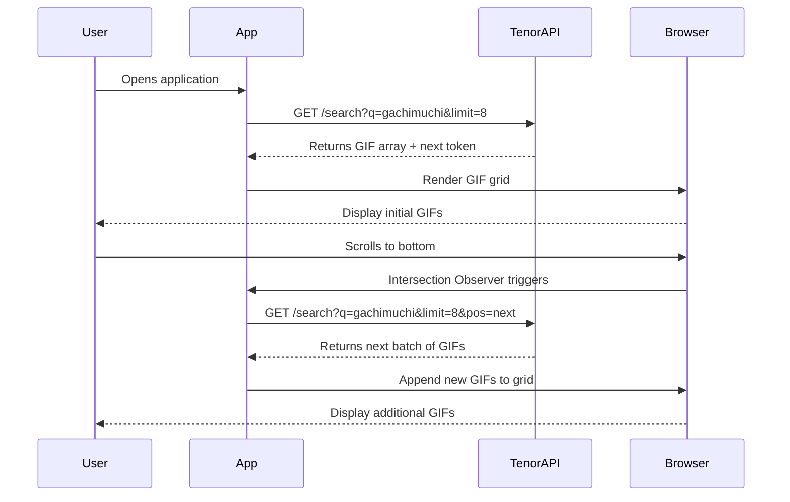
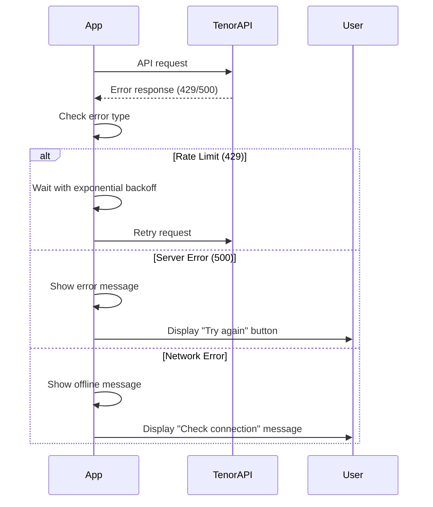

# Core Workflows

## GIF Loading Workflow

```mermaid
sequenceDiagram
    participant User
    participant App
    participant TenorAPI
    participant Browser

    User->>App: Opens application
    App->>TenorAPI: GET /search?q=gachimuchi&limit=8
    TenorAPI-->>App: Returns GIF array + next token
    App->>Browser: Render GIF grid
    Browser-->>User: Display initial GIFs

    User->>Browser: Scrolls to bottom
    Browser->>App: Intersection Observer triggers
    App->>TenorAPI: GET /search?q=gachimuchi&limit=8&pos=next
    TenorAPI-->>App: Returns next batch of GIFs
    App->>Browser: Append new GIFs to grid
    Browser-->>User: Display additional GIFs
```

## Error Handling Workflow

```mermaid
sequenceDiagram
    participant App
    participant TenorAPI
    participant User

    App->>TenorAPI: API request
    TenorAPI-->>App: Error response (429/500)
    App->>App: Check error type

    alt Rate Limit (429)
        App->>App: Wait with exponential backoff
        App->>TenorAPI: Retry request
    else Server Error (500)
        App->>App: Show error message
        App->>User: Display "Try again" button
    else Network Error
        App->>App: Show offline message
        App->>User: Display "Check connection" message
    end
```
