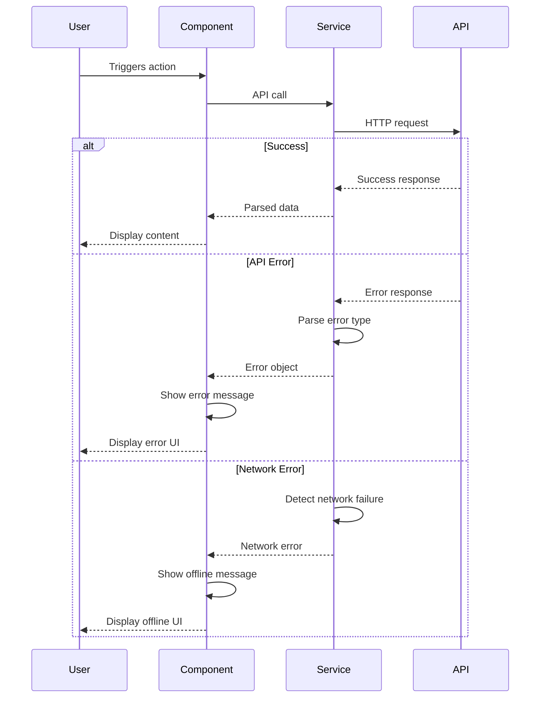

# Error Handling Strategy

## Error Flow



## Error Response Format

```typescript
interface ApiError {
  error: {
    code: string;
    message: string;
    details?: Record<string, any>;
    timestamp: string;
    requestId: string;
  };
}
```

## Frontend Error Handling

```typescript
export const handleAPIError = (error: unknown): string => {
  if (error instanceof Error) {
    if (error.message.includes("429")) {
      return "Too many requests. Please try again later.";
    }
    if (error.message.includes("500")) {
      return "Server error. Please try again.";
    }
    if (error.message.includes("Network")) {
      return "Network error. Please check your connection.";
    }
    return error.message;
  }
  return "An unexpected error occurred.";
};
```

## Backend Error Handling

**N/A - No Backend**
