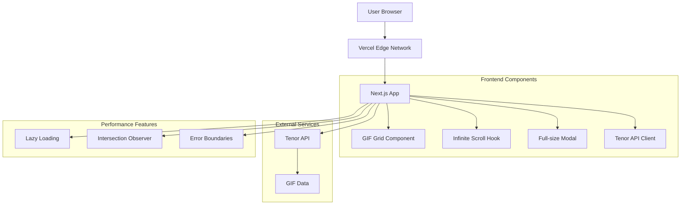

# High Level Architecture

## Technical Summary

This is a Next.js frontend-only application deployed on Vercel with client-side Tenor API integration. The architecture focuses on performance optimization through infinite scrolling using Intersection Observer API, responsive CSS Grid layouts, and lazy loading. No backend services are required as all logic runs in the browser with proper CORS handling for external API calls.

## Platform and Infrastructure Choice

**Platform:** Vercel

- **Key Services:** Vercel Edge Network, Next.js hosting, automatic deployments
- **Deployment Host and Regions:** Global edge network

**Rationale:**

- Next.js-first platform with zero-config deployment
- Global CDN for optimal performance
- Built-in performance optimizations
- Free tier suitable for MVP

## Repository Structure

**Structure:** Monorepo

- **Monorepo Tool:** N/A (single app)
- **Package Organization:** Single Next.js app with organized folders

## High Level Architecture Diagram

## Architectural Patterns

- **Jamstack Architecture:** Static site generation with serverless APIs - _Rationale:_ Optimal performance and scalability for content-heavy applications
- **Component-Based UI:** Reusable React components with TypeScript - _Rationale:_ Maintainability and type safety across large codebases
- **Client-Side State Management:** React hooks and context - _Rationale:_ Simple state needs without external libraries
- **API Client Pattern:** Centralized Tenor API integration - _Rationale:_ Consistent error handling and request management
- **Intersection Observer Pattern:** Native browser API for scroll detection - _Rationale:_ Performance and browser optimization
- **Lazy Loading Pattern:** Progressive image loading - _Rationale:_ Performance with large GIF collections
